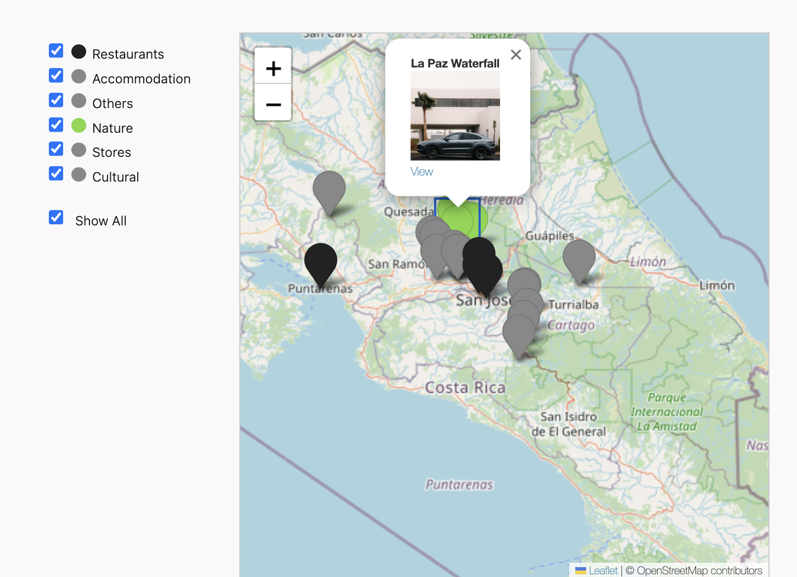

# Custom Map Plugin for WordPress

This plugin lets you **easily create a dynamic, filterable Leaflet map** showcasing posts (e.g., Producers, Places, Events) from a **custom post type** with **ACF fields**.

- 📍 Show posts as map markers
- 🎨 Assign colors by category
- 🗺️ Fully customize pin popups (HTML templates)
- 🎨 Edit the map's CSS
- 🧩 Configure required ACF fields
- 📝 All settings manageable in WordPress Admin

---

## Quick Start

1. Download `custom-map-plugin.zip` from the repository.
2. Upload it in WordPress Admin → Plugins → Add New → Upload Plugin.
3. Activate it.
4. Add `[custom_map]` shortcode to any page or post.

5. Go to **Map Settings** (admin sidebar):
   - Set the **post type** (default is `producer`).
   - Configure **ACF fields**.
   - Set **category colors**.
   - Customize **popup HTML** and **CSS** if needed.

---

## Requirements

- WordPress 6.0+
- Advanced Custom Fields (ACF) plugin
- Your posts must have:
  - ACF field for `latitude`
  - ACF field for `longitude`
  - (Optionally) `profile_img`, `category`, or others for richer popups.

---

## Default ACF Fields (editable)

| ACF Key       | Purpose                        |
| ------------- | ------------------------------ |
| `profile_img` | Image ID for profile picture   |
| `latitude`    | Latitude coordinate (decimal)  |
| `longitude`   | Longitude coordinate (decimal) |
| `category`    | Category name for filtering    |

You can **change** the field names in the **Map Settings**.

---

## Customization

### Category Colors

Assign each category a color using the WordPress color picker.

### Popup HTML Template

Customize the content inside the marker popup using variables.

Example:
´´´html
<b>${marker.title}</b> 
${marker.profile_img_url ? ` ` : ''}
<a href="${marker.page_url}">View Details</a>
´´´

All fields from the ACF fields or WP Post object (like `marker.title`) are available.

### Custom CSS

You can override all map styling easily via a CSS editor field.

---

## Example Screenshot

---

## License

MIT License – free to use, modify, and distribute.
